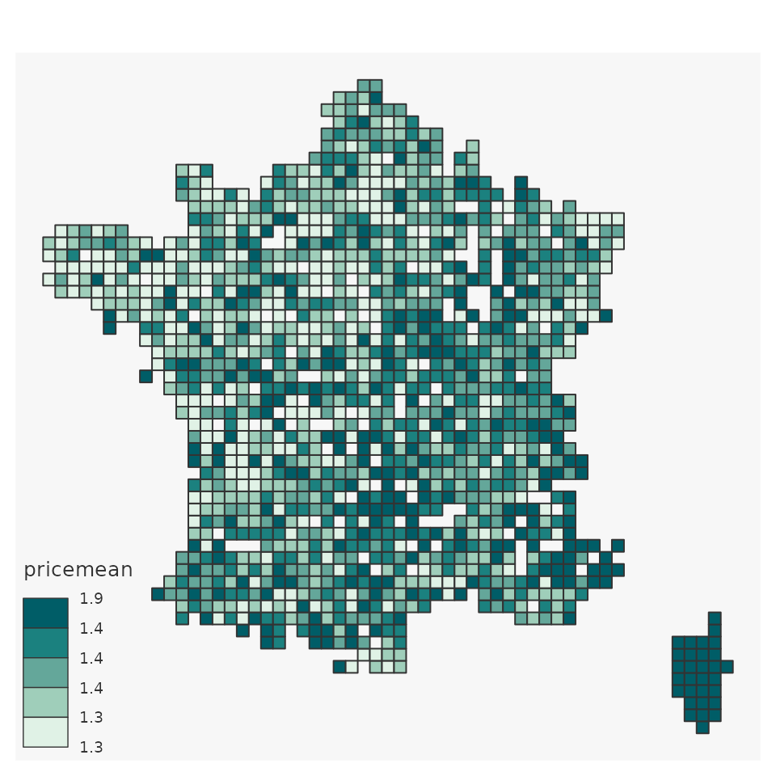
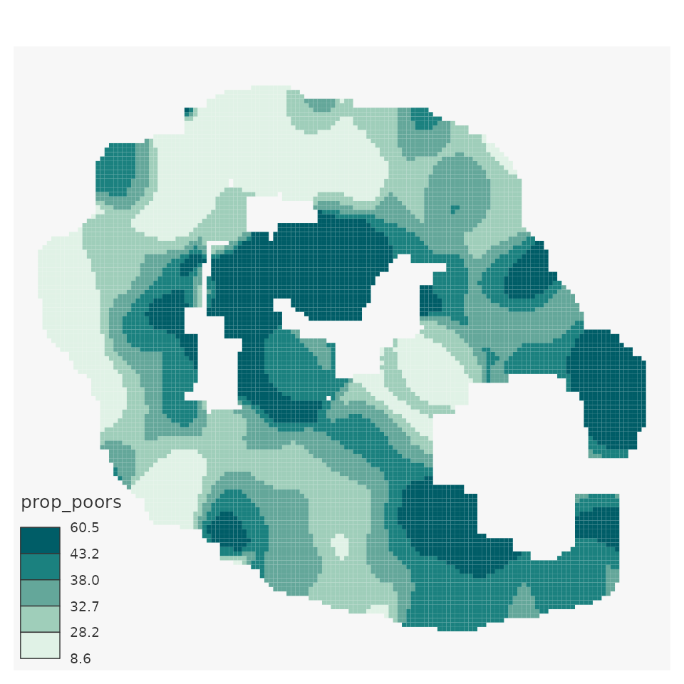

# Spatial smoothing with \`btb\` R package

This document will show you :

- How to install `btb`
- How to perform spatial smoothing :
  - densities
  - means
  - rates
  - quantiles smoothing

Furthermore, it will introduce a way to map your results using `mapsf`
package and how to save your smoothed spatial data using `sf`.

## Install `btb`

`btb` is available on CRAN :

``` r
install.packages("btb")
```

To get a bug fix or to use a feature from the development version, you
can install the development version of from GitHub :

``` r
install.packages("remotes")
remotes::install_github("InseeFr/btb")
```

## Perform spatial smoothing

### Warning with personal data

Spatial smoothing generally reduces individual data disclosure. However,
smoothed data can contain individual information. Please remain cautious
in any case.

### Smoothing gas station prices

#### The data

`btb` package provides several data tables.

For every gas station in metropolitan France, the `dfPrix_SP95_2016`
table gives :

- longitude / latitude coordinates (as numeric variables)
- annual mean price for unleaded gasoline in euros in 2016

``` r
library(btb)
#> Loading required package: dplyr
#> 
#> Attaching package: 'dplyr'
#> The following objects are masked from 'package:stats':
#> 
#>     filter, lag
#> The following objects are masked from 'package:base':
#> 
#>     intersect, setdiff, setequal, union
#> Loading required package: mapsf
data(dfPrix_SP95_2016)
head(dfPrix_SP95_2016)
#>    SP95         x       y
#> 2 1.355  588356.7 6221492
#> 3 1.469  981997.3 6312078
#> 4 1.349  873384.0 6504111
#> 7 1.512 1023983.9 6351175
#> 8 1.480  377274.3 6682264
#> 9 1.403  893440.4 6690013
```

Let’s visualize these stations :

- First, use `sf` package to transform your data.frame as geometric
  points.
- Then, plot them

``` r
library(sf)
#> Linking to GEOS 3.12.1, GDAL 3.8.4, PROJ 9.4.0; sf_use_s2() is TRUE
sfPrix_SP95_2016 <- st_as_sf(dfPrix_SP95_2016,coords = c("x","y"), crs=2154)
plot(sfPrix_SP95_2016$geometry)
```


### Optional step : from points to aggregate grids

To figure out your spatial distribution before smoothing you data, it
can be interesting to aggregate your points inside a grid (e.g : number
of gas stations in 20 km pixels grid), because the smoothing is less
time-consuming

`btb` provides the `btb_add_centroids` and the `btb_ptsToGrid` functions
to make it easy :

- First, associate each point with the centroid of its pixel
  (`btb_add_centroids`). `x_centro` and `y_centro` are created in the
  table.[¹](#fn1)

``` r
dfPrix_SP95_2016 <- btb_add_centroids(dfPrix_SP95_2016, 
                                      iCellSize = 20000,
                                      names_coords = c("x","y"))
head(dfPrix_SP95_2016)
#>    SP95         x       y x_centro y_centro
#> 2 1.355  588356.7 6221492   590000  6230000
#> 3 1.469  981997.3 6312078   990000  6310000
#> 4 1.349  873384.0 6504111   870000  6510000
#> 7 1.512 1023983.9 6351175  1030000  6350000
#> 8 1.480  377274.3 6682264   370000  6690000
#> 9 1.403  893440.4 6690013   890000  6690000
```

- Second, aggregate your data by centroids

``` r
library(dplyr)
centro_values <- dfPrix_SP95_2016 %>%
  group_by(x_centro, y_centro) %>%
  summarise(pricemean=mean(SP95, rm.na = TRUE))
#> `summarise()` has grouped output by 'x_centro'. You can override using the
#> `.groups` argument.
```

- Finally, associate each centroid coordinates with its geometric
  polygon (`btb_ptsToGrid`)

``` r
grid_values <- btb_ptsToGrid(centro_values, sEPSG = 2154,
                             iCellSize = 20000, 
                             names_centro = c("x_centro","y_centro"))
nrow(grid_values)
#> [1] 1328
head(grid_values)
#> Simple feature collection with 6 features and 3 fields
#> Geometry type: POLYGON
#> Dimension:     XY
#> Bounding box:  xmin: 120000 ymin: 6760000 xmax: 160000 ymax: 6860000
#> Projected CRS: RGF93 v1 / Lambert-93
#> # A tibble: 6 × 4
#> # Groups:   x_centro [2]
#>   x_centro y_centro pricemean                                           geometry
#>      <dbl>    <dbl>     <dbl>                                      <POLYGON [m]>
#> 1   130000  6790000      1.33 ((120000 6800000, 140000 6800000, 140000 6780000,…
#> 2   130000  6830000      1.32 ((120000 6840000, 140000 6840000, 140000 6820000,…
#> 3   130000  6850000      1.36 ((120000 6860000, 140000 6860000, 140000 6840000,…
#> 4   150000  6770000      1.35 ((140000 6780000, 160000 6780000, 160000 6760000,…
#> 5   150000  6790000      1.37 ((140000 6800000, 160000 6800000, 160000 6780000,…
#> 6   150000  6810000      1.30 ((140000 6820000, 160000 6820000, 160000 6800000,…
```

Once you have your polygons and your aggregated data, you can map it.
Here, we use the `mapsf` package to do so.

``` r
library(mapsf)

mapsf::mf_map(x = grid_values,
       type = "choro",
       var="pricemean",
       breaks = "quantile",
       nbreaks = 5,
       lwd=1,
       leg_val_rnd = 1)
```



This map represents your aggregated (mean price) but is not smoothed
yet.

Despite its patchwork aspect, this map is a good first step to better
understand your data.

### First smoothing : the density of gas stations

On the example below, we smooth the density of gas stations using 5~000
km pixels and a 100 km bandwidth. Note that we need to create a new
dummy variable (equals to 1 for every station) to count the stations.

``` r

pts_density <- dfPrix_SP95_2016[,c("x","y")]
# Create dummy
pts_density$stations_density <- 1L
head(pts_density)
#>           x       y stations_density
#> 2  588356.7 6221492                1
#> 3  981997.3 6312078                1
#> 4  873384.0 6504111                1
#> 7 1023983.9 6351175                1
#> 8  377274.3 6682264                1
#> 9  893440.4 6690013                1

# Smoothing
smooth_density <- btb_smooth(
  pts = pts_density,
  sEPSG = 2154,
  iBandwidth = 100000,
  iCellSize = 5000)

head(smooth_density)
#> Simple feature collection with 6 features and 3 fields
#> Geometry type: POLYGON
#> Dimension:     XY
#> Bounding box:  xmin: 1170000 ymin: 6005000 xmax: 1200000 ymax: 6010000
#> Projected CRS: RGF93 v1 / Lambert-93
#>         x       y stations_density                       geometry
#> 1 1172500 6007500      0.008703036 POLYGON ((1170000 6010000, ...
#> 2 1177500 6007500      0.010129089 POLYGON ((1175000 6010000, ...
#> 3 1182500 6007500      0.011476304 POLYGON ((1180000 6010000, ...
#> 4 1187500 6007500      0.012691105 POLYGON ((1185000 6010000, ...
#> 5 1192500 6007500      0.013729008 POLYGON ((1190000 6010000, ...
#> 6 1197500 6007500      0.014555589 POLYGON ((1195000 6010000, ...

# Map
mapsf::mf_map(x = smooth_density,
       type = "choro",
       var="stations_density",
       breaks = "quantile",
       nbreaks = 5,
       border = NA,
       leg_val_rnd = 1)
```


Note that `btb_smooth` is *conservative* :

- Number of gas stations in `pts_density` : 5573
- Number of gas station in `smooth_density` : 5573

### Smoothing means : gas mean price

Smoothing a ratio works almost the same way :

- First, you need to smooth both numerator and denominator.
- Then, to calculate a proper smoothed ratio, you must smooth separately
  numerator and denominator and then calculate the ratio. You must not
  smooth directly the ratio.

Note that the `btb_smooth` function smoothes by default all numeric
variables in the input points table (parameter `pts`).

``` r
# Prepare your data
pts_meanprice <- dfPrix_SP95_2016[,c("x","y","SP95")]
pts_meanprice$stations_density <- 1L
head(pts_meanprice)
#>           x       y  SP95 stations_density
#> 2  588356.7 6221492 1.355                1
#> 3  981997.3 6312078 1.469                1
#> 4  873384.0 6504111 1.349                1
#> 7 1023983.9 6351175 1.512                1
#> 8  377274.3 6682264 1.480                1
#> 9  893440.4 6690013 1.403                1

# Smooth both prices and station density
smooth_density <- btb_smooth(
  pts = pts_meanprice,
  sEPSG = 2154,
  iBandwidth = 100000,
  iCellSize = 5000)

head(smooth_density)
#> Simple feature collection with 6 features and 4 fields
#> Geometry type: POLYGON
#> Dimension:     XY
#> Bounding box:  xmin: 1170000 ymin: 6005000 xmax: 1200000 ymax: 6010000
#> Projected CRS: RGF93 v1 / Lambert-93
#>         x       y       SP95 stations_density                       geometry
#> 1 1172500 6007500 0.01320174      0.008703036 POLYGON ((1170000 6010000, ...
#> 2 1177500 6007500 0.01536551      0.010129089 POLYGON ((1175000 6010000, ...
#> 3 1182500 6007500 0.01740988      0.011476304 POLYGON ((1180000 6010000, ...
#> 4 1187500 6007500 0.01925362      0.012691105 POLYGON ((1185000 6010000, ...
#> 5 1192500 6007500 0.02082924      0.013729008 POLYGON ((1190000 6010000, ...
#> 6 1197500 6007500 0.02208448      0.014555589 POLYGON ((1195000 6010000, ...

# Calculate the smoothed mean (from smoothed nominator and denominator)
smooth_density <- smooth_density %>% mutate(meanprice=SP95/stations_density)
mapsf::mf_map(x = smooth_density,
       type = "choro",
       var="meanprice",
       breaks = "quantile",
       nbreaks = 5,
       border = NA,
       leg_val_rnd = 1)
```


### Quantile smoothing : smooth the distribution of gas prices

Quantile smoothing is a different methodology.

Its major benefits are :

- less sensitive to outliers
- gives information on the distribution of your data

``` r

pts_quantiles <- dfPrix_SP95_2016[,c("x","y","SP95")]
head(pts_quantiles)
#>           x       y  SP95
#> 2  588356.7 6221492 1.355
#> 3  981997.3 6312078 1.469
#> 4  873384.0 6504111 1.349
#> 7 1023983.9 6351175 1.512
#> 8  377274.3 6682264 1.480
#> 9  893440.4 6690013 1.403

smooth_quantiles <- btb_smooth(pts = pts_quantiles, 
                               sEPSG = 2154, iBandwidth = 100000,
                               iCellSize = 5000,vQuantiles = c(0.5,0.9))

head(smooth_quantiles)
#> Simple feature collection with 6 features and 5 fields
#> Geometry type: POLYGON
#> Dimension:     XY
#> Bounding box:  xmin: 1170000 ymin: 6005000 xmax: 1200000 ymax: 6010000
#> Projected CRS: RGF93 v1 / Lambert-93
#>   nbObs SP95_05 SP95_09       x       y                       geometry
#> 1    26   1.513    1.53 1172500 6007500 POLYGON ((1170000 6010000, ...
#> 2    27   1.513    1.53 1177500 6007500 POLYGON ((1175000 6010000, ...
#> 3    27   1.513    1.53 1182500 6007500 POLYGON ((1180000 6010000, ...
#> 4    26   1.513    1.53 1187500 6007500 POLYGON ((1185000 6010000, ...
#> 5    26   1.513    1.53 1192500 6007500 POLYGON ((1190000 6010000, ...
#> 6    26   1.513    1.53 1197500 6007500 POLYGON ((1195000 6010000, ...

# Median smoothing : 
mapsf::mf_map(x = smooth_quantiles,
       type = "choro",
       var="SP95_05",
       breaks = "quantile",
       nbreaks = 5,
       border = NA,
       leg_val_rnd = 1)
```


``` r
# Smooth the 9th decile :
mapsf::mf_map(x = smooth_quantiles,
       type = "choro",
       var="SP95_09",
       breaks = "quantile",
       nbreaks = 5,
       border = NA,
       leg_val_rnd = 1)
```


### The iNeighbor parameter

Here, we use data which indicates the number of poor households in
squared data (200 meters) of an island called “La Réunion”.

Each point is the centroid of the grid used to publish aggregated data
(1 000 meters pixels).

Let’s smooth the proportion of poors among households with an
**automatic grid** (`iNeighbor` parameter absent in `btb_smooth`
function).

In the following example, note that the `btb_smooth` function accepts sf
points in input (also the case with `btb_ptsToGrid`).

``` r

# Load data
data("reunion")
head(reunion)
#>        x       y   houhold   phouhold
#> 1 359500 7634300  5.069307  2.3762376
#> 2 359500 7634500 26.930693 12.6237624
#> 3 355900 7634500 15.000000  4.0000000
#> 4 356100 7634500 39.000000 20.0000000
#> 5 356300 7634500 41.642857 15.1428571
#> 6 356500 7634500  2.357143  0.8571429

# Optional : transform as sf points
sfreunion <- sf::st_as_sf(reunion,coords= c("x","y"), crs = 3727)
plot(sfreunion$geometry)
```


``` r

# btb_smooth with an automatic grid
smooth_reunion <- btb_smooth(sfreunion,iCellSize = 500,iBandwidth = 5000)

# Calculate the ratio
smooth_reunion <- smooth_reunion %>% mutate(prop_poors = 100 * phouhold / houhold)

# map
mapsf::mf_map(x = smooth_reunion,
       type = "choro",
       var="prop_poors",
       breaks = "quantile",
       nbreaks = 5,
       border = NA,
       leg_val_rnd = 1)
```



Now, let’s smooth the same ratio, with the same smoothing specifications
(`iBandwidth` and `iCellSize`) but with `iNeighbor = 0`. In this case,
the automatic grid only uses pixels that contain at least one data point
(here, at least one household). The result is quite different.

``` r
smooth_reunion <- btb_smooth(sfreunion,iCellSize = 500,iBandwidth = 5000, iNeighbor = 0)
smooth_reunion <- smooth_reunion %>% mutate(prop_poors = 100 * phouhold / houhold)

mapsf::mf_map(x = smooth_reunion,
       type = "choro",
       var="prop_poors",
       breaks = "quantile",
       nbreaks = 5,
       border = NA,
       leg_val_rnd = 1)
```


### Inspire naming

Using the [Inspire
norm](https://knowledge-base.inspire.ec.europa.eu/index_en),
`btb_smooth` and `btb_ptsToGrid` allow you to name your pixels in a
proper international way. It could be useful for reuse purpose, merge
operations, etc.

You just need to use `inspire = TRUE` :

``` r
smooth_reunion <- btb_smooth(sfreunion,iCellSize = 500,
                             iBandwidth = 2000, iNeighbor = 0, inspire = TRUE)
smooth_reunion <- smooth_reunion %>% mutate(prop_poors = 100 * phouhold / houhold)
head(smooth_reunion)
#> Simple feature collection with 6 features and 6 fields
#> Geometry type: POLYGON
#> Dimension:     XY
#> Bounding box:  xmin: 355500 ymin: 7634000 xmax: 360000 ymax: 7635000
#> Projected CRS: Reunion 1947 / TM Reunion
#>        x       y   houhold phouhold                     idInspire
#> 1 359750 7634250  58.60575 24.13523 CRS3727RES500mN7634000E359500
#> 2 355750 7634750 158.31143 69.21210 CRS3727RES500mN7634500E355500
#> 3 356250 7634750 191.80652 87.96571 CRS3727RES500mN7634500E356000
#> 4 356750 7634750 195.59692 90.96524 CRS3727RES500mN7634500E356500
#> 5 357750 7634750 125.03327 53.53656 CRS3727RES500mN7634500E357500
#> 6 358750 7634750  89.45056 34.01019 CRS3727RES500mN7634500E358500
#>                         geometry prop_poors
#> 1 POLYGON ((359500 7634500, 3...   41.18236
#> 2 POLYGON ((355500 7635000, 3...   43.71895
#> 3 POLYGON ((356000 7635000, 3...   45.86169
#> 4 POLYGON ((356500 7635000, 3...   46.50648
#> 5 POLYGON ((357500 7635000, 3...   42.81785
#> 6 POLYGON ((358500 7635000, 3...   38.02121
```

Then, to export your geometric data, you can use the
[`sf::write_sf`](https://r-spatial.github.io/sf/reference/st_write.html)
function.

``` r
sf::write_sf("MY/REPOSITORY/myfile.gpkg")
```

### References :

- Geographically weighted summary statistics : a framework for localised
  exploratory data analysis, C.Brunsdon & al., in Computers, Environment
  and Urban Systems C.Brunsdon & al. (2002)
  [doi:10.1016/S0198-9715(01)00009-6](https://doi.org/10.1016/S0198-9715(01)00009-6)
- Statistical Analysis of Spatial and Spatio-Temporal Point Patterns,
  Third Edition, Diggle, pp. 83-86, (2003)
  [doi:10.1080/13658816.2014.937718](https://doi.org/10.1080/13658816.2014.937718).
- <https://inseefrlab.github.io/formation-r-lissage-spatial/tuto.html>

### Some interesting use cases

- <https://r.iresmi.net/posts/2019/kernel_spatial_smoothing_transforming_points_pattern_to_continuous_coverage/>
- <https://semba-blog.netlify.app/06/30/2020/kernel-smoothin-of-spatial-data/>

------------------------------------------------------------------------

1.  By default, the grid is centered on the geographical referential
    origin. If you want to shift this origin, use the `offset`
    parameter.
